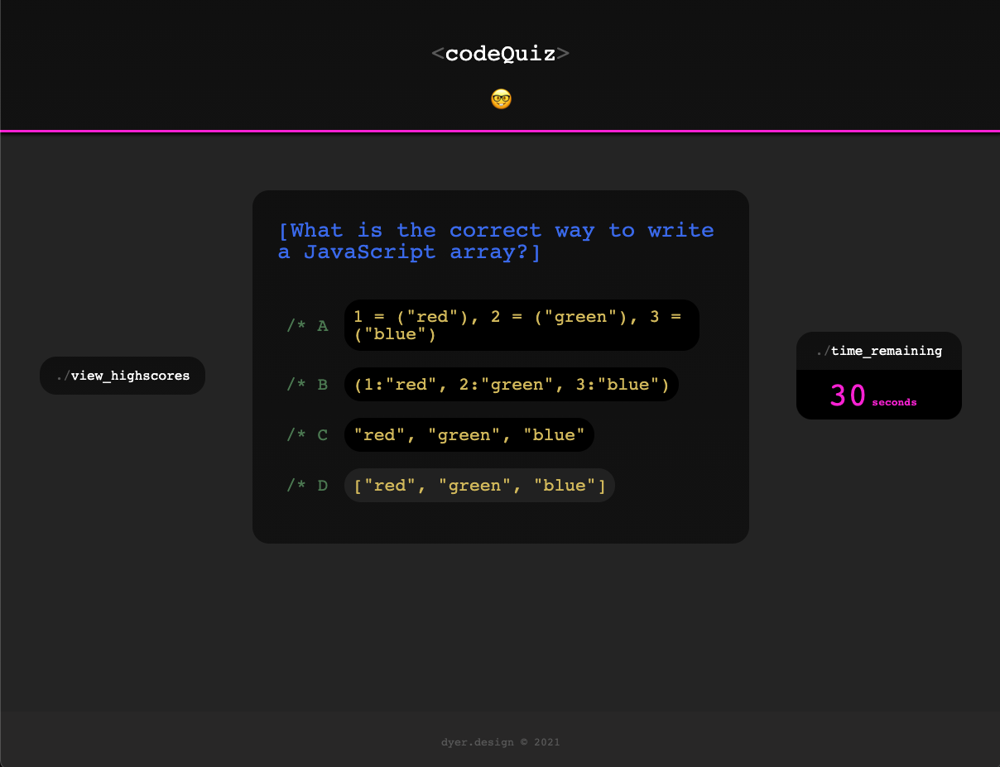

## Code Quiz

<br />

## Repo Contents

<li>README.md</li>
<li>index.html</li>
<li>scores.html</li>
<li>quiz.css</li>
<li>scores.css</li>
<li>quiz.js</li>
<li>scores.js</li>
<li>reset.css</li>
<li>images</li>
<li>sounds</li>
<li>Deployed URL</li>

<br />


## Screens / Demo

<br />


<br />

<br />

https://www.youtube.com/embed/cl9FFxNyA3o


<br />
<br />

## The Ask

Create a quiz application to test the JavaScript knowledge of your classmates. Users click through interactive questions, then enter initials to save their highscore before resetting and starting over.

## User Story

```
AS A coding boot camp student
I WANT to take a timed quiz on JavaScript fundamentals that stores high scores
SO THAT I can gauge my progress compared to my peers
```

## Criteria

```
Start button begins quiz by loading first question/answer bank, starting timer at 60 seconds.

Answering correctly moves on to the next question, earning 200 points.

Answering incorrectly subtracts 5 seconds from timer, awarding no points.

When all the questions are answered, user is presented with score and input field to save initials.

If time depletes before completion, user is presented with score with no opportunity to save.

Highscores button presents leaderboard with top 3 saved scores.

Clear scores button removes all recently saved scores.
```

## Deployed URL

https://github.com/djdyer/code-quiz
<br />
https://djdyer.github.io/code-quiz
<br />

## Collaborators

Code generated largely in deliberation and collaboration between BCS tutor Simon Rennocks, classmate Olsen Ogouchi, and myself.
